# Cardmaker Infrastructure Architecture

## Overview
Cardmaker is a serverless art creation platform deployed on AWS with Memberstack authentication integration.

## High-Level Architecture Diagram

```mermaid
graph TB
    %% Users
    User[👤 User's Browser]

    %% CloudFront Layer
    subgraph CloudFront["☁️ CloudFront CDN"]
        CFTest["Test Environment<br/>d1km502pp6onh8.cloudfront.net"]
        CFProd["Production Environment<br/>d1tc1pwgiayrtm.cloudfront.net"]
    end

    %% S3 Static Assets
    subgraph S3["🗄️ S3 Buckets (Private)"]
        S3Test["Test Bucket<br/>Static Files"]
        S3Prod["Prod Bucket<br/>Static Files"]
    end

    %% API Gateway Layer
    subgraph APIGateway["🌐 API Gateway REST API"]
        APITest["Test API<br/>imjd82jn21.execute-api"]
        APIProd["Prod API<br/>1injnhd53d.execute-api"]
    end

    %% Lambda Layer
    subgraph Lambda["⚡ AWS Lambda"]
        LambdaTest["Test Function<br/>Node.js 20.x<br/>128MB / 10s timeout"]
        LambdaProd["Prod Function<br/>Node.js 20.x<br/>128MB / 10s timeout"]
    end

    %% Memberstack
    Memberstack["🔐 Memberstack<br/>admin.memberstack.com"]

    %% Connections
    User -->|HTTPS| CloudFront

    CFTest -->|OAI Read Access| S3Test
    CFProd -->|OAI Read Access| S3Prod

    CFTest -->|API Calls| APITest
    CFProd -->|API Calls| APIProd

    APITest -->|Invoke| LambdaTest
    APIProd -->|Invoke| LambdaProd

    LambdaTest -->|Verify JWT<br/>Get Member Info| Memberstack
    LambdaProd -->|Verify JWT<br/>Get Member Info| Memberstack

    User -.->|Login/Signup<br/>DOM Package| Memberstack

    %% Styling
    classDef aws fill:#FF9900,stroke:#232F3E,stroke-width:2px,color:#232F3E
    classDef memberstack fill:#6B46C1,stroke:#553C9A,stroke-width:2px,color:#fff
    classDef user fill:#4299E1,stroke:#2B6CB0,stroke-width:2px,color:#fff

    class CloudFront,S3,APIGateway,Lambda aws
    class Memberstack memberstack
    class User user
```



## Detailed Request Flow


## Environment Architecture

```mermaid
graph LR
    subgraph Local["💻 Local Development"]
        LocalBrowser["Browser<br/>localhost:8080"]
        LocalServer["Express Server<br/>localhost:3001"]
        LocalHandler["Lambda Handler<br/>(simulated)"]
    end

    subgraph Test["🧪 Test Environment (AWS)"]
        TestCF["CloudFront<br/>d1km502pp6onh8"]
        TestAPI["API Gateway<br/>imjd82jn21"]
        TestLambda["Lambda<br/>Test Stack"]
    end

    subgraph Prod["🚀 Production Environment (AWS)"]
        ProdCF["CloudFront<br/>d1tc1pwgiayrtm"]
        ProdAPI["API Gateway<br/>1injnhd53d"]
        ProdLambda["Lambda<br/>Prod Stack"]
    end

    subgraph MS["Memberstack"]
        MSSandbox["Sandbox Environment<br/>pk_sb_* / sk_sb_*<br/>(50 member limit)"]
        MSLive["Live Environment<br/>pk_* / sk_*<br/>(unlimited)"]
    end

    LocalBrowser --> LocalServer
    LocalServer --> LocalHandler
    LocalHandler -.->|Test Keys| MSSandbox

    TestCF --> TestAPI
    TestAPI --> TestLambda
    TestLambda -->|Test Keys| MSSandbox

    ProdCF --> ProdAPI
    ProdAPI --> ProdLambda
    ProdLambda -->|Live Keys| MSLive

    style Local fill:#90CDF4,stroke:#2C5282
    style Test fill:#FBD38D,stroke:#744210
    style Prod fill:#9AE6B4,stroke:#22543D
    style MS fill:#DDD6FE,stroke:#5B21B6
```



## Security Architecture


**Security Features**:
1. **HTTPS Only**: All traffic encrypted in transit
2. **Private S3**: Bucket accessible only via CloudFront OAI
3. **Rate Limiting**: Prevents abuse (10 req/sec per endpoint)
4. **JWT Authentication**: Memberstack validates all member requests
5. **Environment Isolation**: Test and prod use separate Memberstack environments
6. **Secret Management**: Keys stored in environment variables, not code
7. **Git Hooks**: Prevents commits with "nocheckin" markers

## Deployment Architecture

```mermaid
graph LR
    Dev["👨‍💻 Developer"]

    subgraph CDK["AWS CDK Infrastructure"]
        Config["config/{env}.json"]
        Stack["lib/cardmaker-stack.js"]
        App["bin/app.js"]
    end

    subgraph AWS["☁️ AWS CloudFormation"]
        TestStack["CardmakerStack-Test"]
        ProdStack["CardmakerStack-Prod"]
    end

    subgraph Resources["Deployed Resources"]
        Lambda2["Lambda Functions"]
        API2["API Gateways"]
        CF2["CloudFront Distributions"]
        S32["S3 Buckets"]
    end

    Dev -->|npm run deploy:test| CDK
    Dev -->|npm run deploy:prod| CDK
    CDK -->|cdk deploy| AWS
    AWS --> Resources

    TestStack -.->|Creates/Updates| Lambda2
    ProdStack -.->|Creates/Updates| API2
    TestStack -.->|Creates/Updates| CF2
    ProdStack -.->|Creates/Updates| S32
```



**Deployment Process**:
1. Load environment config (`config/{env}.json`)
2. Validate Memberstack keys in environment variables
3. Create/update CloudFormation stack via CDK
4. Deploy Lambda function with environment-specific config
5. Configure API Gateway with throttling and CORS
6. Create S3 bucket and CloudFront distribution
7. Inject Memberstack public key into `config.js`
8. Upload static files to S3
9. Invalidate CloudFront cache

## Member Info Retrieval Flow

```mermaid
flowchart TD
    Start([User clicks 'Get Member Info']) --> CheckAuth{Authenticated?}
    CheckAuth -->|No| ShowLogin[Show Memberstack Login Modal]
    ShowLogin --> Login[User Logs In]
    Login --> StoreJWT[JWT Stored in Cookies]

    CheckAuth -->|Yes| GetJWT[Retrieve JWT from Cookies]
    StoreJWT --> GetJWT

    GetJWT --> CallAPI[POST /member-info<br/>Authorization: Bearer JWT]
    CallAPI --> RateCheck{Rate Limit OK?}

    RateCheck -->|No| Error429[Return 429 Too Many Requests]
    RateCheck -->|Yes| InvokeLambda[Lambda Invoked]

    InvokeLambda --> VerifyToken[POST /members/verify-token<br/>to Memberstack]
    VerifyToken --> TokenValid{Token Valid?}

    TokenValid -->|No| Error401[Return 401 Unauthorized]
    TokenValid -->|Yes| GetMemberData[GET /members/{id}<br/>from Memberstack]

    GetMemberData --> FilterData[Filter Member Data<br/>email, name, plans]
    FilterData --> ReturnSuccess[Return 200 + Member Info]

    Error429 --> DisplayError[Display Error to User]
    Error401 --> DisplayError
    ReturnSuccess --> DisplayInfo[Display Member Info on Page]

    style Start fill:#4299E1
    style DisplayInfo fill:#48BB78
    style DisplayError fill:#F56565
    style CheckAuth fill:#ED8936
    style TokenValid fill:#ED8936
    style RateCheck fill:#ED8936
```

## AWS Resource Details

### CloudFront Distribution
- **Test**: `E22DT60R3G76F5` → https://d1km502pp6onh8.cloudfront.net
- **Production**: → https://d1tc1pwgiayrtm.cloudfront.net
- **Features**:
  - Free SSL/TLS certificates
  - HTTP → HTTPS redirect
  - Gzip/Brotli compression
  - Global edge caching
  - Error handling (403/404 → index.html)
  - Origin Access Identity (OAI): `E2Z2Y6SRJHDZYY`

### API Gateway
- **Type**: REST API
- **Stage**: `api`
- **Throttling**:
  - Global: 100 req/sec rate, 200 burst
  - Per-method: 10 req/sec rate, 20 burst
- **CORS**: Enabled for all origins
- **Endpoints**:
  - `POST /multiply` - Math calculation
  - `POST /member-info` - Member data retrieval

### Lambda Function
- **Runtime**: Node.js 20.x
- **Memory**: 128 MB
- **Timeout**: 10 seconds
- **Handler**: `src/lambda/handler.js`
- **Environment Variables**:
  - `ENVIRONMENT` (local/test/prod)
  - `DEBUG_MODE` (true/false)
  - `MEMBERSTACK_PUBLIC_KEY`
  - `MEMBERSTACK_SECRET_KEY`

### S3 Buckets
- **Access**: Private (no public access)
- **Content**: Static frontend files (index.html, app.js, config.js, styles.css)
- **Deployment**: Automated via CDK BucketDeployment
- **Access Method**: CloudFront OAI only

## Environment Configuration

### Key Environment Differences

| Feature | Local | Test | Production |
|---------|-------|------|------------|
| **Frontend URL** | http://localhost:8080 | https://d1km502pp6onh8.cloudfront.net | https://d1tc1pwgiayrtm.cloudfront.net |
| **Backend URL** | http://localhost:3001 | https://imjd82jn21.execute-api.us-west-2.amazonaws.com/api/ | https://1injnhd53d.execute-api.us-west-2.amazonaws.com/api/ |
| **Memberstack Keys** | Sandbox (`pk_sb_*`) | Sandbox (`pk_sb_*`) | Live (`pk_*`) |
| **Debug Mode** | Enabled | Enabled | Disabled |
| **CloudFront Price Class** | N/A | 100 (US, EU) | All (Global) |
| **Stack Name** | N/A | CardmakerStack-Test | CardmakerStack-Prod |

### Environment Variables

Required environment variables (stored in `.env`, not committed to git):

```bash
# Local Development
CM_MEMBERSTACK_LOCAL_PUBLIC_KEY=pk_sb_...
CM_MEMBERSTACK_LOCAL_SECRET_KEY=sk_sb_...

# Test Environment
CM_MEMBERSTACK_TEST_PUBLIC_KEY=pk_sb_...
CM_MEMBERSTACK_TEST_SECRET_KEY=sk_sb_...

# Production Environment
CM_MEMBERSTACK_PROD_PUBLIC_KEY=pk_...
CM_MEMBERSTACK_PROD_SECRET_KEY=sk_...

# Optional
CM_PORT=3001
CM_HOST=localhost
```

## Testing Infrastructure


**Testing Coverage**:
- **Unit Tests**: Lambda handler logic (multiply, member-info)
- **E2E Tests**: Frontend forms, calculations, loading states, errors, rate limiting
- **API Tests**: API Gateway throttling behavior
- **Manual Tests**: Curl scripts for quick API validation
- **CI/CD**: Automated Playwright tests on push/PR to master

## Technology Stack

### Frontend
- **HTML/CSS/JavaScript**: Vanilla JS (ES6 modules)
- **Authentication UI**: Memberstack DOM Package
- **Dev Server**: live-server (auto-refresh)
- **Build**: None (direct file deployment)

### Backend
- **Runtime**: Node.js 20.x
- **Framework**: None (pure Lambda handler)
- **HTTP Client**: Native Node.js HTTPS module
- **Authentication**: Memberstack Admin API

### Infrastructure
- **IaC**: AWS CDK (JavaScript)
- **Cloud Provider**: AWS
- **Services**: Lambda, API Gateway, S3, CloudFront, IAM, CloudWatch
- **Region**: us-west-2 (Oregon)
- **Account**: 145023121294

### Third-Party Services
- **Authentication**: Memberstack (memberstack.com)
- **API Endpoints**:
  - Frontend: Memberstack DOM Package
  - Backend: admin.memberstack.com

## Cost Optimization

**Serverless Benefits**:
- **Lambda**: Pay only for compute time (128MB, 10s max)
- **API Gateway**: Pay per request + data transfer
- **S3**: Pay for storage + requests (minimal static files)
- **CloudFront**: Free SSL, pay for data transfer out
- **No EC2 Instances**: Zero idle costs

**Rate Limiting**:
- Prevents abuse and runaway costs
- 10 req/sec per endpoint limit
- 100 req/sec global API limit

**Environment Separation**:
- Test uses cheaper CloudFront price class (US/EU only)
- Production uses global distribution
- Separate stacks prevent accidental prod scaling

## Scalability

**Auto-Scaling Components**:
- **Lambda**: Scales automatically (up to account limits)
- **API Gateway**: Handles thousands of concurrent requests
- **CloudFront**: Global CDN with edge locations worldwide
- **S3**: Unlimited storage and throughput

**Current Limits**:
- Lambda concurrency: Configured per environment
- API throttling: 10 req/sec per method, 100 req/sec global
- Memberstack sandbox: 50 members max (test only)

## Monitoring & Logging

```mermaid
graph LR
    subgraph Logs["📊 Observability"]
        CWLogs["CloudWatch Logs<br/>Lambda execution logs"]
        APILogs["API Gateway Logs<br/>Request/response logs"]
        CFLogs["CloudFront Logs<br/>Access logs (optional)"]
    end

    Lambda3["Lambda"] --> CWLogs
    API3["API Gateway"] --> APILogs
    CF3["CloudFront"] -.->|Optional| CFLogs

    style Logs fill:#FEEBC8,stroke:#744210
```



**Logging Levels by Environment**:
- **Local**: Verbose logging, debug mode enabled
- **Test**: Verbose logging, debug mode enabled
- **Production**: Minimal logging, debug mode disabled

## Key Design Decisions

1. **Serverless Architecture**: Auto-scaling, pay-per-use, no server management
2. **Multi-Environment Isolation**: Separate stacks prevent cross-contamination
3. **Private S3 + OAI**: Security best practice (no public bucket access)
4. **Rate Limiting**: Cost control and abuse prevention
5. **JWT Authentication**: Delegated to Memberstack (expertise + maintenance)
6. **CDN-First**: Global performance via CloudFront edge locations
7. **Infrastructure as Code**: Repeatable deployments via AWS CDK
8. **Config Injection**: Secrets injected at deploy time, not hardcoded
9. **Environment Detection**: Frontend auto-detects environment (no manual config)
10. **Git Hooks**: Pre-commit validation prevents sensitive data commits

## Current Deployment Status

**CloudFormation Stacks** (as of 2025-12-17):
- `CardmakerStack-Test`: UPDATE_COMPLETE (last updated 2025-12-16)
- `CardmakerStack-Prod`: UPDATE_COMPLETE (last updated 2025-12-17)

**Region**: us-west-2 (Oregon)
**Account**: 145023121294

---

## Quick Reference

### URLs
- **Test Frontend**: https://d1km502pp6onh8.cloudfront.net
- **Test API**: https://imjd82jn21.execute-api.us-west-2.amazonaws.com/api/
- **Prod Frontend**: https://d1tc1pwgiayrtm.cloudfront.net
- **Prod API**: https://1injnhd53d.execute-api.us-west-2.amazonaws.com/api/
- **Local Frontend**: http://localhost:8080
- **Local API**: http://localhost:3001

### Common Commands
```bash
# Local Development
npm start                  # Start local dev server (frontend)
npm run server            # Start local API server (backend)

# Deployment
npm run deploy:test       # Deploy to test environment
npm run deploy:prod       # Deploy to production environment
npm run destroy:test      # Destroy test stack
npm run destroy:prod      # Destroy production stack

# Testing
npm test                  # Run unit tests
npm run test:frontend     # Run E2E Playwright tests
npm run test:watch        # Run tests in watch mode

# Other
npm run bootstrap         # One-time CDK bootstrap
```

### Environment Variable Setup
1. Copy `.env.example` to `.env`
2. Add Memberstack keys for each environment
3. Never commit `.env` file to git
4. See `.env.example` for required variables
